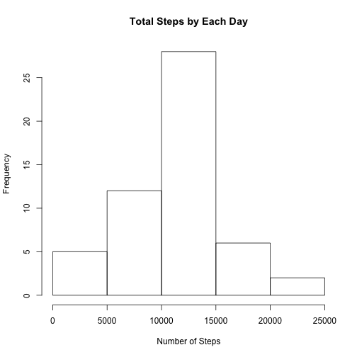
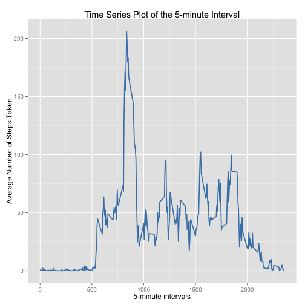
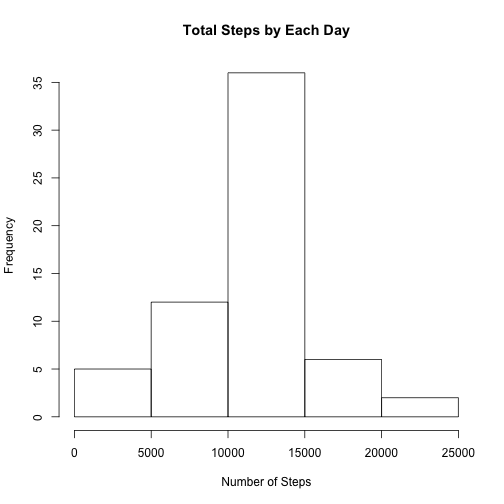
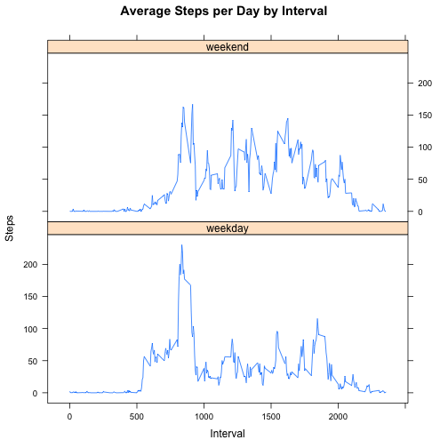

### Basic settings

```r
echo = TRUE 
library(ggplot2)
```
This assignment makes use of data from a personal activity monitoring device. This device collects data at 5 minute intervals through out the day. The data consists of two months of data from an anonymous individual collected during the months of October and November, 2012 and include the number of steps taken in 5 minute intervals each day.

## Loading and preprocessing the data

```r
unzip("activity.zip")
data <- read.csv("activity.csv", colClasses = c("integer", "Date", "factor"))
data$month <- as.numeric(format(data$date, "%m"))
```

## What is mean total number of steps taken per day?
1.Calculate the total number of steps taken per day

```r
totalsteps <- aggregate(steps ~ date, data, sum)
```
2.Make a histogram of the total number of steps taken each day  

```r
hist(totalsteps$steps, main = paste("Total Steps by Each Day"), xlab="Number of Steps")
```

 

3.Calculate and report the mean and median of the total number of steps taken per day

```r
mean <- mean(totalsteps$steps)
median <- median(totalsteps$steps)
```
**For the total number of steps taken per day:**  
- **Mean: 10766.1886792453**
- **Median: 10765**

## What is the average daily activity pattern?
1.Make a time series plot (i.e. type = "l") of the 5-minute interval (x-axis) and the average number of steps taken, averaged across all days (y-axis)

```r
avgstepsinterval <- aggregate(steps ~ interval, data,FUN="mean")
avgstepsinterval$interval <- as.integer(levels(avgstepsinterval$interval)[avgstepsinterval$interval])
colnames(avgstepsinterval) <- c("interval", "steps")

ggplot(avgstepsinterval, aes(interval, steps)) + geom_line(color = "steelblue", size = 0.8) + labs(title = "Time Series Plot of the 5-minute Interval", x = "5-minute intervals", y = "Average Number of Steps Taken")
```

 

2.Which 5-minute interval, on average across all the days in the dataset, contains the maximum number of steps? 

```r
max_interval <- avgstepsinterval[which.max(avgstepsinterval$steps),1]
```
The **835<sup>th</sup> interval** has the maximum activity on the average.

## Imputing missing values
1.Calculate and report the total number of missing values in the dataset (i.e. the total number of rows with NAs)

```r
summary(data$steps)
```

```
##    Min. 1st Qu.  Median    Mean 3rd Qu.    Max.    NA's 
##    0.00    0.00    0.00   37.38   12.00  806.00    2304
```
2.Devise a strategy for filling in all of the missing values in the dataset. The strategy does not need to be sophisticated. For example, you could use the mean/median for that day, or the mean for that 5-minute interval, etc.
3.Create a new dataset that is equal to the original dataset but with the missing data filled in.

```r
datanew <- data 
for (i in 1:nrow(datanew)) {
    if (is.na(datanew$steps[i])) {
        datanew$steps[i] <- avgstepsinterval[which(datanew$interval[i] == avgstepsinterval$interval), ]$steps
    }
}
summary(datanew)
```

```
##      steps             date               interval         month      
##  Min.   :  0.00   Min.   :2012-10-01   0      :   61   Min.   :10.00  
##  1st Qu.:  0.00   1st Qu.:2012-10-16   10     :   61   1st Qu.:10.00  
##  Median :  0.00   Median :2012-10-31   100    :   61   Median :10.00  
##  Mean   : 37.38   Mean   :2012-10-31   1000   :   61   Mean   :10.49  
##  3rd Qu.: 27.00   3rd Qu.:2012-11-15   1005   :   61   3rd Qu.:11.00  
##  Max.   :806.00   Max.   :2012-11-30   1010   :   61   Max.   :11.00  
##                                        (Other):17202
```

4.Make a histogram of the total number of steps taken each day and Calculate and report the mean and median total number of steps taken per day. Do these values differ from the estimates from the first part of the assignment? What is the impact of imputing missing data on the estimates of the total daily number of steps?


```r
totalstepsnew <- aggregate(steps ~ date, datanew, sum)
hist(totalstepsnew$steps, main = paste("Total Steps by Each Day"), xlab="Number of Steps")
```

 

```r
mean(totalsteps$steps)
```

```
## [1] 10766.19
```

```r
mean(totalstepsnew$steps)
```

```
## [1] 10766.19
```

```r
median(totalsteps$steps)
```

```
## [1] 10765
```

```r
median(totalstepsnew$steps)
```

```
## [1] 10766.19
```
The median has increased

## Are there differences in activity patterns between weekdays and weekends?
1.Create a new factor variable in the dataset with two levels – “weekday” and “weekend” indicating whether a given date is a weekday or weekend day.

```r
datanew$weekdays <- factor(format(datanew$date, "%A"))
levels(datanew$weekdays)
```

```
## [1] "Friday"    "Monday"    "Saturday"  "Sunday"    "Thursday"  "Tuesday"  
## [7] "Wednesday"
```

```r
levels(datanew$weekdays) <- list(weekday = c("Monday", "Tuesday",
                                             "Wednesday", 
                                             "Thursday", "Friday"),
                                 weekend = c("Saturday", "Sunday"))
levels(datanew$weekdays)
```

```
## [1] "weekday" "weekend"
```

```r
table(datanew$weekdays)
```

```
## 
## weekday weekend 
##   12960    4608
```

2.Make a panel plot containing a time series plot (i.e. type = "l") of the 5-minute interval (x-axis) and the average number of steps taken, averaged across all weekday days or weekend days (y-axis). 


```r
avgstepsintervalnew <- aggregate(datanew$steps, 
                      list(interval = as.numeric(as.character(datanew$interval)), 
                           weekdays = datanew$weekdays),
                      FUN = "mean")
names(avgstepsintervalnew)[3] <- "steps"

library(lattice)

xyplot(avgstepsintervalnew$steps ~ avgstepsintervalnew$interval|avgstepsintervalnew$weekdays, main="Average Steps per Day by Interval",xlab="Interval", ylab="Steps",layout=c(1,2), type="l")
```

 
